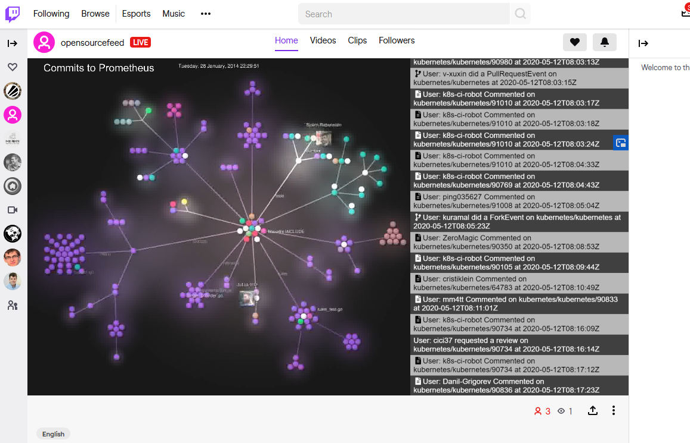
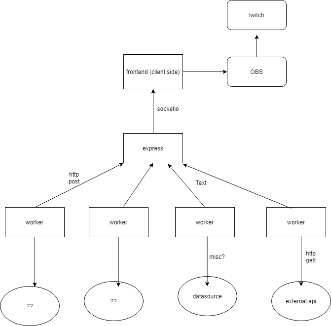

# Open Source Feed on Twitch

This app controls the [opensourcefeed](https://twitch.tv/opensourcefeed) livestream. It keeps a 24/7 heartbeat of all the open source code and contributions flying around the internet.

# Architecture

# Quickstart

- Configure `config.sh` from `example.config.sh`
- Run `npm install` in `web` dir
- Run `virtualenv --python=python3 venv` in `workers/github`
- Run `source venv/bin/activate`
- Run `pip install -r requirements.txt` in `workers/github` dir (possibly in venv)
- Return to top level directory (with `README.md`)
- Run `run-apps.sh`

# License

Apache 2.0

# References

- <https://cloud-native-tools.herokuapp.com/>
- <https://github.com/garethr/cloud-native-tools>
- <https://landscape.cncf.io/selected=kong>
- <https://landscape.cncf.io/data.json>
- <https://developer.github.com/v3/activity/events/>
- <https://help.github.com/en/github/visualizing-repository-data-with-graphs/viewing-a-repositorys-network>
